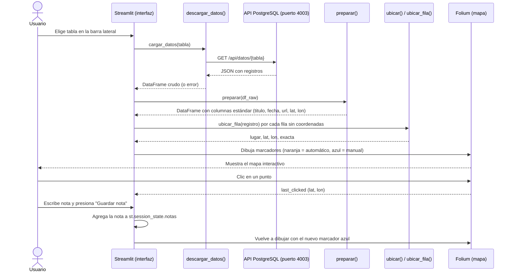

# Diagrama de comportamiento de los módulos — Mapa Interactivo

Este diagrama muestra cómo interactúan las funciones de `ejemplo_dashboard.py` cuando una persona usa el dashboard.

```mermaid
sequenceDiagram
    actor Usuario
    participant UI as Streamlit (interfaz)
    participant Datos as descargar_datos()
    participant API as API PostgreSQL (puerto 4003)
    participant Prep as preparar()
    participant Ubicar as ubicar() / ubicar_fila()
    participant Mapa as Folium (mapa)

    Usuario->>UI: Elige tabla en la barra lateral
    UI->>Datos: cargar_datos(tabla)
    Datos->>API: GET /api/datos/{tabla}
    API-->>Datos: JSON con registros
    Datos-->>UI: DataFrame crudo (o error)
    UI->>Prep: preparar(df_raw)
    Prep-->>UI: DataFrame con columnas estándar (titulo, fecha, url, lat, lon)
    UI->>Ubicar: ubicar_fila(registro) por cada fila sin coordenadas
    Ubicar-->>UI: lugar, lat, lon, exacta
    UI->>Mapa: Dibuja marcadores (naranja = automático, azul = manual)
    Mapa-->>Usuario: Muestra el mapa interactivo
    Usuario->>Mapa: Clic en un punto
    Mapa-->>UI: last_clicked (lat, lon)
    Usuario->>UI: Escribe nota y presiona "Guardar nota"
    UI->>UI: Agrega la nota a st.session_state.notas
    UI->>Mapa: Vuelve a dibujar con el nuevo marcador azul
```
